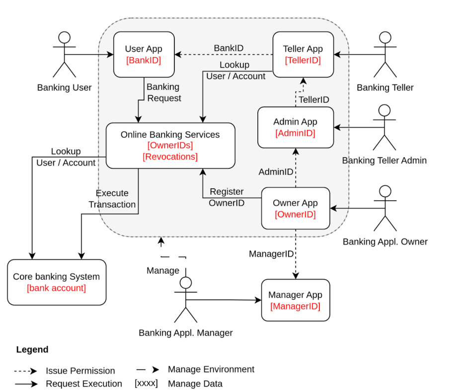

# System Scope and Context

# Buisness Context:

| **System**                  | **Description**                                                                                          |
|-----------------------------|----------------------------------------------------------------------------------------------------------|
| **User App**                 | Allows banking users to submit requests for account information and transactions, identified by `BankID`. |
| **Online Banking Services**  | Central hub managing requests from User, Teller, and Admin Apps. Manages `OwnerIDs` and `Revocations`.    |
| **Teller App**               | Interface for banking tellers to look up user and account information, identified by `TellerID`.          |
| **Admin App**                | Used by teller admins to manage teller operations and permissions, identified by `AdminID`.               |
| **Owner App**                | Interface for the banking application owner to manage high-level settings and operations, identified by `OwnerID`. |
| **Manager App**              | Used by the banking application manager to oversee operations and transactions, identified by `ManagerID`. |
| **Core Banking System**      | Legacy system responsible for storing user account data and executing transactions.                       |
| **Banking User**             | End-users who interact with the system to perform banking operations.                                     |
| **Banking Teller**           | Performs customer-facing tasks such as transactions and account lookups.                                 |
| **Banking Teller Admin**     | Manages teller permissions and oversees teller operations.                                                |
| **Banking Application Owner**| Responsible for the overall ownership and administration of the banking system.                          |
| **Banking Application Manager**| Manages and oversees the overall banking application environment.                                        |
