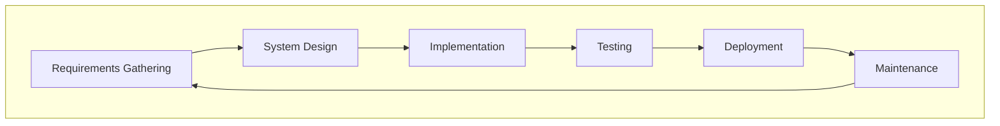
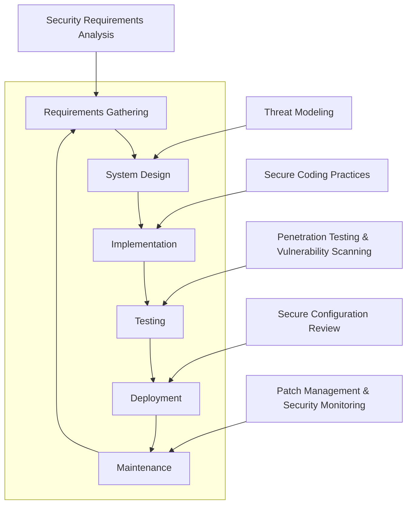

# Secure Software Development Life Cycle (SSDLC) Documentation

## Table of Contents
1. [Introduction](#introduction)
2. [What is SDLC?](#what-is-sdlc)
    - [Stages of SDLC](#stages-of-sdlc)
3. [What is SSDLC?](#what-is-ssdlc)
    - [Stages of SSDLC](#stages-of-ssdlc)
4. [Why SSDLC?](#why-ssdlc)
5. [How SSDLC Was Applied in Our Project](#how-ssdlc-was-applied-in-our-project)

## Introduction
The software development process involves multiple stages that transform an idea into a functional product. The Software Development Life Cycle (SDLC) provides a structured approach to this process, ensuring that technical requirements are met efficiently. However, with increasing cyber threats, integrating security measures at every stage has become critical. The Secure Software Development Life Cycle (SSDLC) extends SDLC by embedding security practices throughout the development process, proactively addressing vulnerabilities and reducing risks.

## What is SDLC?
The Software Development Life Cycle (SDLC) is a systematic approach to software development that ensures the final product is high-quality, meets customer requirements, and is delivered within schedule and budget constraints.

## Stages of SDLC

#### 1. Requirements Gathering
Stakeholders collaborate to define what the software needs to achieve, identifying both functional and non-functional requirements.

#### 2. System Design
Designers and architects create a blueprint for the software, detailing architecture, database design, and interface specifications.

#### 3. Implementation
Developers write and integrate the code following the design specifications.

#### 4. Testing
Testers validate the software against requirements, identifying and fixing bugs or discrepancies.

#### 5. Deployment
The software is released to production and made available to end users.

#### 6. Maintenance
Post-deployment, the software undergoes updates and patches to address issues and enhance functionality.

## What, then, is SSDLC?
The Secure Software Development Life Cycle (SSDLC) enhances SDLC by embedding security practices throughout. This ensures that potential vulnerabilities are identified and mitigated early, minimizing the risk of security breaches.

### Stages of SSDLC

#### Additional Security Practices in SSDLC
- **Security Requirements Analysis**: Ensuring security requirements are identified during the initial stages.
- **Threat Modeling**: Assessing potential threats to the design and architecture.
- **Secure Coding Practices**: Adopting standards to prevent vulnerabilities like SQL injection and buffer overflows.
- **Penetration Testing & Vulnerability Scanning**: Actively identifying vulnerabilities in the software.
- **Secure Configuration Review**: Verifying deployment environments are configured securely.
- **Patch Management & Security Monitoring**: Keeping software updated and monitored for emerging threats.

## Why SSDLC?
### Key Benefits
1. **Proactive Risk Mitigation**:
   - Addressing vulnerabilities during development reduces the cost and effort required to fix issues post-deployment.
2. **Regulatory Compliance**:
   - Aligning with standards such as GDPR, HIPAA, and ISO 27001 ensures legal and industry compliance.
3. **Enhanced Trust**:
   - Secure software builds confidence among stakeholders and users.

### Analogy
Integrating security into SDLC is akin to constructing a building with reinforced materials:
- Without SSDLC: A standard house prone to break-ins.
- With SSDLC: A fortified structure resistant to external threats.

# SSDLC in Our Project

## How it was implemented
1. **Security Requirements Analysis**:
   - Example: Ensured encryption for sensitive data storage.
2. **Threat Modeling**:
   - Example: Analyzed risks in user authentication mechanisms.
3. **Secure Coding Practices**:
   - Example: Used input validation to prevent SQL injection attacks.
4. **Penetration Testing & Vulnerability Scanning**:
   - Example: Automated scans identified and resolved dependency vulnerabilities.
5. **Secure Configuration Review**:
   - Example: Enforced HTTPS and disabled unnecessary ports.
6. **Patch Management & Security Monitoring**:
   - Example: Regularly updated libraries and monitored logs for anomalies.
   
## SDLC vs SSDLC in Our Project
| SDLC Stage             | What SDLC Requires                        | SSDLC Implementation                          | Why SSDLC Was Better                          |
|------------------------|------------------------------------------|----------------------------------------------|----------------------------------------------|
| Requirements Gathering | Gather functional requirements.          | Included security requirements analysis.       | Reduced late-stage rework.                   |
| Design                 | Create architectural designs.            | Performed threat modeling.                    | Identified attack vectors early.             |
| Implementation         | Write and integrate code.                | Followed secure coding practices.             | Minimized vulnerabilities in production.     |
| Testing                | Conduct functional testing.              | Performed penetration testing and scanning.   | Discovered critical issues proactively.      |
| Deployment             | Deploy software to production.           | Conducted secure configuration reviews.       | Ensured safe default settings.               |
| Maintenance            | Maintain and update software.            | Established patch management processes.       | Addressed new threats effectively.           |

---
This comprehensive documentation outlines the significance of SSDLC, providing both general insights and a project-specific template. The structured approach helps ensure that security is prioritized throughout the software development process.
