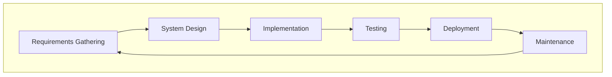
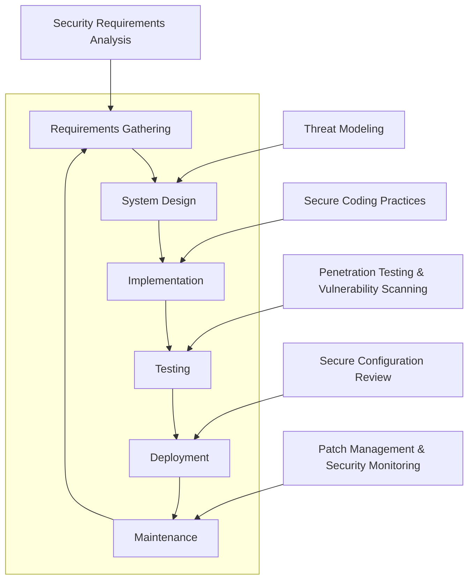

# Secure Software Development Life Cycle (SSDLC) Documentation

## Table of Contents
1. [Introduction](#introduction)
2. [What is SDLC?](#what-is-sdlc)
    - [Stages of SDLC](#stages-of-sdlc)
3. [What is SSDLC?](#what-then-is-ssdlc)
    - [Stages of SSDLC](#stages-of-ssdlc)
4. [Why SSDLC?](#why-ssdlc)
5. [How SSDLC Was Applied in Our Project](#how-it-was-implemented)

## Introduction
The software development process involves multiple stages that transform an idea into a functional product. The Software Development Life Cycle (SDLC) provides a structured approach to this process, ensuring that technical requirements are met efficiently. However, with increasing cyber threats, integrating security measures at every stage has become critical. The Secure Software Development Life Cycle (SSDLC) extends SDLC by embedding security practices throughout the development process, proactively addressing vulnerabilities and reducing risks.

## What is SDLC?
The Software Development Life Cycle (SDLC) is a systematic approach to software development that ensures the final product is high-quality, meets customer requirements, and is delivered within schedule and budget constraints.

## Stages of SDLC

#### 1. Requirements Gathering
Stakeholders collaborate to define what the software needs to achieve, identifying both functional and non-functional requirements.

#### 2. System Design
Designers and architects create a blueprint for the software, detailing architecture, database design, and interface specifications.

#### 3. Implementation
Developers write and integrate the code following the design specifications.

#### 4. Testing
Testers validate the software against requirements, identifying and fixing bugs or discrepancies.

#### 5. Deployment
The software is released to production and made available to end users.

#### 6. Maintenance
Post-deployment, the software undergoes updates and patches to address issues and enhance functionality.

## What, then, is SSDLC?
The Secure Software Development Life Cycle (SSDLC) enhances SDLC by embedding security practices throughout. This ensures that potential vulnerabilities are identified and mitigated early, minimizing the risk of security breaches.

### Stages of SSDLC

#### Additional Security Practices in SSDLC
- **Security Requirements Analysis**: Ensuring security requirements are identified during the initial stages.
- **Threat Modeling**: Assessing potential threats to the design and architecture.
- **Secure Coding Practices**: Adopting standards to prevent vulnerabilities like S
- QL injection and buffer overflows.
- **Penetration Testing & Vulnerability Scanning**: Actively identifying vulnerabilities in the software.
- **Secure Configuration Review**: Verifying deployment environments are configured securely.
- **Patch Management & Security Monitoring**: Keeping software updated and monitored for emerging threats.

## Why SSDLC?
### Key Benefits
1. **Proactive Risk Mitigation**:
   - Addressing vulnerabilities during development reduces the cost and effort required to fix issues post-deployment.
2. **Regulatory Compliance**:
   - Aligning with standards such as GDPR, HIPAA, and ISO 27001 ensures legal and industry compliance.
3. **Enhanced Trust**:
   - Secure software builds confidence among stakeholders and users.

### Analogy
Integrating security into SDLC is akin to constructing a building with reinforced materials:
- Without SSDLC: A standard house prone to break-ins.
- With SSDLC: A fortified structure resistant to external threats.

# SSDLC in Our Project

### How it was implemented
### 1. Requirements Gathering

- The first stage of the SDLC involved close collaboration with stakeholders to understand both business and security requirements. 
- We focused on designing security from the ground up, ensuring a strong foundation for the entire development process.

### Incorporating Security Requirements
- We held workshops with stakeholders to identify key security requirements and mapped out the data flow across the application. Ensuring security was prioritized, we decided to encrypt sensitive data both at rest and in transit. 
- Security features like device binding, JWT authentication, and OTP verification were incorporated to safeguard user access and maintain the integrity of data.

### Compliance and Regulatory Requirements
- As our application was designed for banking services, we ensured strict compliance with GDPR for user data privacy and the ISO20022 standard for secure financial transactions. We identified critical regulatory controls during this phase and documented them to ensure we adhered to legal standards in every stage of the SDLC.

### Addressing Privacy and Security Concerns
- During this phase, we focused on minimizing data collection. Stakeholder meetings led to decisions about only collecting the most necessary data and being transparent with end-users about how their data would be used. Clear data privacy policies were written for the user agreement.

---

# 2. System Design

- The system design phase is where the architecture of the application is laid out, and security is integrated into every aspect of the design. We used threat modeling, established secure design patterns, and defined how security features would be implemented.

### Threat Modeling
- We adopted the OWASP Threat Modeling methodology to evaluate potential threats and vulnerabilities in the system architecture. By identifying threats at this stage, we could mitigate risks before they became issues during implementation. 
- Threat modeling helped us recognize attack vectors like Cross-Site Scripting (XSS) and SQL Injection, and we planned countermeasures for each identified risk.

### Architectural Security
- **Principle of Least Privilege:** We ensured that each microservice and user role was granted only the minimum level of access required to perform their function. For instance, database permissions were restricted to specific queries to prevent unauthorized access to sensitive information.
- **JWT Authentication:** We incorporated JWT-based authentication for all APIs to ensure secure access.
- **Rate-Limiting and DoS Protection:** To avoid Denial of Service (DoS) attacks, we implemented rate-limiting at the registration level, ensuring that multiple requests from the same IP address would be throttled.
- **API Protection:** We ensured that all APIs were protected by authentication and had built-in access control checks to prevent unauthorized access or data exposure.

### Security Case Study
- During design, we identified a potential SQL Injection vulnerability due to poor input validation. We mitigated this by enforcing parameterized queries across all database interactions and sanitizing inputs.

# 3. Implementation

- In the implementation phase, we focused on secure coding practices, security scans, and integrating automated tools to detect vulnerabilities early in the development process.

### Secure Coding Standards
- We followed OWASP Secure Coding Practices, including input sanitization, output encoding, and SQL query parameterization. This was done to prevent common vulnerabilities such as SQL Injection and Cross-Site Scripting (XSS).

   **Example:** We implemented a rule to ensure that any external data (such as from user input) is properly sanitized before being used in database queries.

### Security Scans in CI/CD
- We automated static code analysis using SonarQube to check for vulnerabilities in every pull request before it was merged into the main branch. Additionally, PMD checks were integrated into the CI/CD pipeline to enforce secure coding practices, ensuring that no code malpractice could slip into production.

**Example:** Any new pull request that did not meet the security requirements automatically failed the pipeline and could not be merged.

### Vulnerability Prevention
One significant vulnerability discovered during development was a hardcoded API key in a configuration file. We quickly replaced it with environment variables, ensuring that keys were stored securely and never exposed in the code.

---

# 4. Testing

   Testing was a critical phase for identifying vulnerabilities that could have been overlooked during development. We performed both manual penetration testing and automated vulnerability scans to ensure the robustness of the application.

### Unit and Integration Testing
- Unit tests were written to validate the functionality of individual components and methods, ensuring that they performed as expected in isolation. Integration tests were then implemented to verify the interaction between components, ensuring that different modules of the application worked seamlessly together. 
- These tests helped identify issues early and ensured that both functional and security requirements were met.

### Vulnerability Scanning Tools
- We used OWASP ZAP and Dependabot for scanning the application for known vulnerabilities, focusing on dependency issues and misconfigurations. Dependabot was particularly useful in identifying vulnerable dependencies that could have been exploited by attackers.

### Security Test Cases
..
---

# 5. Deployment

The deployment phase was critical in ensuring that the infrastructure was securely configured and that the application could withstand any security threats post-deployment.

### Secure Deployment Configuration
- Leveraging GitOps and using tools like AWS, ArgoCD, and GitHub, we maintained version-controlled, auditable configurations. This ensured that all infrastructure changes were traceable and aligned with the security policies. We applied strict access controls using AWS IAM roles and policies to restrict access to the infrastructure, ensuring that only authorized users and services could modify deployment configurations.

### Network and Security Configurations
- Deployed resources within AWS private subnets with secure firewall settings, ensuring that only necessary traffic could reach the application.
- Enabled HTTPS for all communications, managed via AWS Certificate Manager (ACM) to ensure the confidentiality and integrity of data.
- We used AWS Secrets Manager to store sensitive information securely, such as API keys and database credentials.

# 6. Maintenance

- The maintenance phase is where the focus shifts to continuous monitoring and the application of security patches to ensure long-term protection against emerging threats.

### Tracking and Applying Patches
- We used Dependabot to monitor and automatically create pull requests for outdated dependencies. Critical security patches were applied within 24 hours to prevent potential exploitation. Any new vulnerabilities identified in third-party libraries were addressed promptly to minimize the attack surface.

### Monitoring and Incident Response
- We integrated **Grafana** for real-time monitoring and set up alerts to detect any unusual behavior or potential security incidents, such as a Denial of Service (DoS) attack. 
- AWS **CloudWatch** was used to log and monitor all interactions with sensitive resources, ensuring that any unauthorized access was detected quickly.
- Monitored **Argo CD logs** for additional visibility into the deployment process, tracking any unusual activities or failures that could indicate potential security issues or system misconfigurations.

**Example of Prevented Incident:** During the maintenance phase, Grafana alerts detected unusual traffic patterns on the user API, which indicated a potential DoS attack. We responded by implementing rate-limiting to prevent the system from being overwhelmed by excessive requests.

---

By integrating security at every stage of the SDLC, we ensured that security was not an afterthought but a core part of the entire development process. From secure coding practices to continuous monitoring, this comprehensive approach to SSDL helped us deliver a secure and resilient banking application.
   
## SDLC vs SSDLC in Our Project
| SDLC Stage             | What SDLC Requires                        | SSDLC Implementation                          | Why SSDLC Was Better                          |
|------------------------|------------------------------------------|----------------------------------------------|----------------------------------------------|
| Requirements Gathering | Gather functional requirements.          | Included security requirements analysis.       | Reduced late-stage rework.                   |
| Design                 | Create architectural designs.            | Performed threat modeling.                    | Identified attack vectors early.             |
| Implementation         | Write and integrate code.                | Followed secure coding practices.             | Minimized vulnerabilities in production.     |
| Testing                | Conduct functional testing.              | Performed penetration testing and scanning.   | Discovered critical issues proactively.      |
| Deployment             | Deploy software to production.           | Conducted secure configuration reviews.       | Ensured safe default settings.               |
| Maintenance            | Maintain and update software.            | Established patch management processes.       | Addressed new threats effectively.           |

---
This comprehensive documentation outlines the significance of SSDLC, providing both general insights and a project-specific template. The structured approach helps ensure that security is prioritized throughout the software development process.
